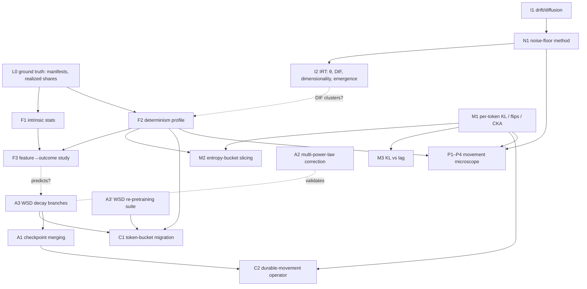

# Dataset-analysis idea map

Structured extraction of every experiment, instrument, and measurement proposed in
the dataset-analysis subset of the Research Trajectory page (now mirrored whole in
[refs/research-trajectory-pre-to-post-training.md](refs/research-trajectory-pre-to-post-training.md)),
organized so we can pick a first project and decide what infrastructure serves several paths at once.

Companion ground truth for the DataDecide recipes themselves (what tokens are actually in each mix,
how sampling and seeds work, where the shards live):
`~/drotherm/data/.claude/datadec/2026-08-19/2013-dclm25-dolma75-training-data.md`.

---

## 1. The shape of the space

Everything in the subset is one of five kinds of thing. The kinds build on each other roughly bottom-up:

| Layer | What it is | Example |
|---|---|---|
| **L0 — Ground truth about the data** | What is literally in each recipe, at token level | shard manifests, realized token shares, constituent provenance |
| **L1 — Dataset featurization** | Scalar/curve descriptors of a corpus computed without training on it | WIMBD stats, compression ratio, diversity coefficient, **determinism profile** |
| **L2 — Measurement instruments over released results** | Better-than-accuracy observables extracted from DataDecide's published eval matrix | drift/diffusion decomposition, IRT ability θ, item bank with DIF flags, noise-floor estimates |
| **L3 — Per-token / per-layer movement between checkpoints** | Inference over released checkpoints on a fixed probe corpus | per-token KL(t‖t+1), entropy-bucket slicing, prediction flips, CKA drift |
| **L4 — Schedule neutralization** | Ways to obtain "annealed" readouts from cosine mid-run checkpoints | checkpoint merging, multi-power-law correction, **WSD decay branches** |
| **L5 — Causal/interventional studies** | Requires new training (branches, fine-tunes, deficits) | token-bucket migration under decay, movement microscope Stages 2–4, critical-period timing |

Two hypotheses thread through all layers and are what the instruments exist to test:

- **H-beyond-loss:** pretraining data shapes models beyond final loss — recipes at matched loss differ in
  movement profile, item-level behavior, or post-training response.
- **H-river-valley:** valley geometry is a data property — deterministic tokens form the river, uncertain
  tokens the walls — so a corpus's determinism profile should predict annealing behavior, mid-schedule
  "noise," and where post-training acts.

---

## 2. Idea catalog

Cost tiers: **T0** = analysis of already-published numbers · **T1** = inference over released checkpoints/corpora ·
**T2** = small fine-tunes / short decay branches (single GPU) · **T3** = new pretraining runs (subset of recipes at 150M–300M).

### L1 — Dataset featurization

**F1 · Intrinsic-statistics featurization of the 25 recipes** — T1
- *What:* compute WIMBD-style corpus statistics (duplication, length distributions, domain composition),
  compression ratios, Zipf/burstiness/type-token stats, and the Task2Vec diversity coefficient for each recipe;
  regress DataDecide's outcome table (per-task, per-scale, ~300 pairwise decisions) on the features.
- *Tests:* do intrinsic features predict outcomes as well as model-mediated ones (perplexity correlations, RegMix-style
  mixture weights)? Which properties matter, not just which named domain?
- *Depends on:* L0 manifests (sample each recipe's actual shards, not its label). *Feeds:* F3, I3, M2.
- *Caveat surfaced by L0:* recipe labels are not token fractions (the DCLM/Dolma mixes are 43/69/87% DCLM by tokens,
  not 25/50/75) — featurization must be computed on realized token pools, and "mixture weight" baselines must use realized shares.

**F2 · Determinism profile per recipe** — T1
- *What:* score tokens from each corpus with a strong reference model's conditional entropy (and an ensemble or larger
  model to separate aleatoric floor from reference ignorance); characterize a corpus by its per-token entropy distribution,
  reported as curves over entropy thresholds × context lengths, before and after dedup.
- *Tests:* H-river-valley's featurization prediction — does the profile predict valley geometry, decay-responsiveness,
  and annealed-vs-unannealed disagreement? Also formalizes the "code is low-entropy" folk explanation.
- *Prior art to reuse:* DoReMi excess loss, Rho-1 reference-model scoring (same machinery, different goal).
- *Depends on:* L0. *Feeds:* F3, M3, C1, I2-DIF follow-up.

**F3 · Supervised feature→outcome study** — T0 once F1/F2 exist
- *What:* the joint regression/ranking study using F1 + F2 features against DataDecide outcomes and the model-mediated baselines.
- *Alternative framing:* predict landscape/annealing quantities (from A1–A3) instead of benchmark outcomes.

### L2 — Instruments over released results

**I1 · Drift/diffusion decomposition of checkpoint trajectories** — T0
- *What:* on Signal-and-Noise's released 900K results (OLMo dense checkpoints, DataDecide, ladder models), separate
  each benchmark×recipe×scale trajectory into directional drift (learning) and mean-reverting diffusion (wall jitter)
  via autocorrelation, increment sign-consistency, and variance-vs-lag scaling (diffusion ∝ lag, drift ∝ lag²).
- *Tests:* which evals detect learning between adjacent checkpoints vs. only wiggle; prediction that continuous metrics
  have high drift/diffusion and accuracy low; recipes differing in drift/diffusion signature at matched loss (H-beyond-loss);
  diffusion should scale with current LR and drift should not (H-river-valley, using cosine decay as an in-run LR sweep).
- *Design note:* DataDecide checkpoints are sparse — fit diffusion on denser OLMo trajectories, transfer to DataDecide's grid.
- *Feeds:* noise floor for every later movement claim (M1), corrects Signal-and-Noise's windowed-noise assumption (N1).

**I2 · IRT on the DataDecide eval matrix** — T0 (needs per-item results)
- *What:* fit item-response models to rows = model×checkpoint (recipe×scale×seed×step), columns = items, with both binary
  and continuous-response (likelihood-margin) variants.
- *Sub-results, each standalone:*
  - **θ(t) as movement metric** — test SNR(θ trajectories) > SNR(accuracy trajectories).
  - **Dimensionality check** — one latent dimension fitting well ⇒ recipes differ along one axis at these scales
    (deflates H-beyond-loss here); multiple ⇒ the factor structure *is* what recipes change.
  - **Recipe-DIF** — items behaving differently across recipes at matched ability = H-beyond-loss formalized;
    follow-up: do DIF items cluster by determinism bucket (F2) or domain?
  - **Per-item emergence points** — item characteristic curves vs. compute turn emergence into a distribution.
  - **Binary vs. continuous IRT comparison** replicates Signal-and-Noise's metric-choice finding in one framework.
- *Cautions:* local-independence violations (shared passages, contamination) — fit diagnostics double as a contamination detector.
- *Depends on:* per-item eval results (DataDecide publishes per-task; per-instance availability needs confirming — datadec's
  `qa_instances_ingest` notebook is the existing probe).

**N1 · Noise-floor methodology for n=3 seeds** — T0
- *What:* (a) pool seed variance across recipes at fixed scale (~50 dof) and test heteroscedasticity — a recipe whose seeds diverge
  more is itself a finding; (b) use late-checkpoint windows as replicates (Signal-and-Noise's trick), corrected by I1's drift
  estimate; (c) bootstrap over items for benchmark-composition uncertainty.
- *Fact to build on:* DataDecide's loglikelihood evals are effectively deterministic at a fixed checkpoint — re-evaling with new
  seeds buys nothing; all variance of interest is in training (seed/init/order), and prompt/demo choice is a systematic bias axis, not noise.
- *Feeds:* every comparison in I1, I2, M-series.

### L3 — Per-token / per-layer movement between released checkpoints

**M1 · Adjacent-checkpoint movement metrics on a probe corpus** — T1
- *What:* for a subset of recipes and checkpoint pairs: per-token KL(ckpt_t ‖ ckpt_t+1) on a fixed probe corpus, item-level
  prediction-flip rates (churn), and layerwise CKA / linear-map residual drift.
- *Tests:* how much benchmark "noise" is item-level exchange at constant marginal accuracy; which layers move.
- *Depends on:* checkpoint loading + logprob extraction pipeline. *Feeds:* M2, M3, C2.

**M2 · Entropy-bucket slicing of movement** — T1
- *What:* slice M1's per-token KL by F2's entropy buckets.
- *Tests:* H-river-valley's sharpest released-data prediction — mid-schedule movement concentrates on high-entropy (wall) tokens
  while low-entropy tokens carry drift. Dividend: a principled low-noise eval construction (weight items by token determinism)
  replacing empirical subtask filtering.
- *Depends on:* F2 + M1.

**M3 · Transient vs. durable movement via KL(t, t+k)** — T1
- *What:* KL as a function of lag k — transient movement cancels, durable accumulates. Statistical complement to I1 at token level.
- *Upgrade path:* the causal version is A1/A3 applied at t and t+k (see C2).

### L4 — Schedule neutralization (getting annealed readouts)

Three alternatives for the same goal, ordered by cost; they can validate each other.

**A1 · Checkpoint merging as pseudo-annealing on cosine checkpoints** — T1
- *What:* WSM-style merge of a sliding window of checkpoints with decay-emulating weights; eval the merged model.
- *Open question (itself a small experiment):* merging is validated on stable-phase checkpoints; does it work when LR varies within
  the merge window (cosine)? If approximately yes, "annealed" evals can be retrofitted onto all of DataDecide for the cost of evals.
- *Depends on:* checkpoint loading. *Validated against:* A3.

**A2 · Multi-power-law analytic correction of loss curves** — T0
- *What:* use the multi-power law to predict the loss drop a hypothetical decay would produce from each trajectory.
- *Gives:* how much each recipe's apparent ranking is schedule artifact. *Doesn't give:* downstream metrics.
- *Nuance:* DataDecide found intermediate-checkpoint decisions match compute-equivalent final ones, so the confound may cancel for
  rankings while distorting levels and post-training starting points — A3 is what settles when it cancels.

**A3 · WSD decay branches from released checkpoints** — T2
- *What:* short decay branches (MiniCPM/Hägele protocol, ~10% of budget) from existing cosine checkpoints; eval the annealed endpoints.
- *Gives:* the correct annealed readout per checkpoint; ground truth for A1/A2; the per-token instrument for C1.
- *Caveat:* decay itself makes river progress, so branch length is a parameter to control, not a pure "reveal."
- *Bigger sibling:* **A3' · DataDecide-with-WSD** (T3) — rerun a subset of recipes at 150M–300M with a stable phase and branches at
  regular intervals. The open multi-recipe WSD suite the methodology papers say should exist.

### L5 — Causal / interventional studies

**C1 · Token-bucket migration under decay** — T2 (on A3) or T3 (on A3')
- *What:* each branch gives a per-token decay-responsiveness score (loss drop under decay: responsive = wall, inert = at the river).
  Branch repeatedly along training to get the trajectory of bucket membership; compare migration dynamics across recipes for the
  *same* held-out tokens; cross with an epistemic/aleatoric decomposition (aleatoric via ensemble or larger reference model).
- *Tests:* decay-responsiveness tracks epistemic-not-aleatoric uncertainty; recipes differ in epistemic-drainage schedules, not aleatoric
  floors. Would be the missing token-level validation of river-valley, a causal determinism profile (F2 made causal), and an
  explanation of *when* annealed and unannealed evals disagree.
- *Adjacent literature it would unify:* Rho-1's loss-trajectory token taxonomy; the RLVR forking-token result (walls = where RL works).

**C2 · Durable movement operator** — T1/T2
- *What:* apply A1 (or A3) at t and t+k and compare the *annealed* models: movement surviving the schedule-neutralizing transform is
  river movement by construction. Decomposes Signal-and-Noise "noise" into measurement noise + wall oscillation + unseen drift.
- *Depends on:* A1 or A3 + M1.

**P1–P4 · The post-training "movement microscope"** — T2
- **P1 Noise floor:** null distribution of movement for one recipe — post-training re-seeded, re-ordered, hyperparameter-jittered,
  and (crucially) *continued pretraining on the same data for the same token budget*. Evaluate every candidate metric against it
  (per-token KL, likelihood margins, accuracy, layerwise CKA, ΔW norm/effective rank).
- **P2 Calibration with guaranteed-effect interventions:** memorize a narrow distribution; distill from a large teacher (KL-to-teacher
  = ground-truth movement axis); TinyZero-style within-reach tasks. Yields a dose-response curve per metric ("KL detects 1k-example SFT at 20σ; MMLU detects nothing").
- **P3 Decompose movement** by layer, by token bucket (F2), and by direction (toward fine-tune distribution / teacher / orthogonal).
- **P4 The recipe question:** post-train all 25 recipes identically; compare movement *profiles* at matched loss rather than outcomes.
- *Depends on:* M1 pipeline, N1/I1 floors, F2 for the token slice. P1–P3 are publishable regardless of P4's outcome.

**K1 · Critical-period / Fisher timing study** — T3 (mostly outside this subset; listed because it shares instruments)
- *What:* sibling seeds with timed deficits; log Fisher trace, pairwise interpolation barriers, ICL curves; ask whether deficit sensitivity
  for elicitability closes when it closes for accuracy. Shares the checkpoint-pair instruments (M1, CKA, barriers) and the Task2Vec/Fisher
  featurization link to F1.

---

## 3. Dependency graph

Reading it: **L0, F2, M1, N1/I1 are hubs** — each unlocks three or more downstream ideas. A3 is the gate to everything causal.

---

## 4. Alternatives and forks

| Goal | Options | Trade |
|---|---|---|
| Annealed readouts from cosine checkpoints | A1 merge · A2 analytic · A3 branches · A3' re-pretrain | cost ascends; fidelity ascends; A1's validity on cosine windows is itself unknown (cheap experiment) |
| Lower-noise movement metric | I2 θ(t) · I1-filtered continuous metrics · M1 per-token KL · N1 windowed replicates | θ needs per-item data; per-token KL needs checkpoints + probe corpus; windowed replicates need I1's drift correction |
| Token determinism measurement | F2 reference-model entropy (static, cheap) · C1 decay-responsiveness (causal, needs branches) · Rho-1-style loss-trajectory classes (from released checkpoints, T1) | the three should agree if river-valley is right — disagreement is informative |
| Matched-loss recipe comparison | I2 recipe-DIF · I1 drift/diffusion signatures · P4 movement profiles · M2 bucket-resolved movement | DIF is the most formal and cheapest given per-item data |
| Featurization family | F1 intrinsic · F2 determinism · model-mediated baselines (perplexity-correlation, RegMix weights) · similarity embeddings (Task2Vec alignment) | intrinsic answers "what property mattered"; model-mediated predicts best; run all and compare |
| Temporal resolution | DataDecide checkpoints (sparse, many recipes) · OLMo checkpoints (dense, one recipe) | fit fine-grained dynamics on OLMo, transfer to DataDecide |

---

## 5. Shared infrastructure — what to build once

Ordered by how many ideas each serves.

1. **Eval-matrix loader with full structure** (I1, I2, N1, F3, A2). Rows keyed recipe×scale×seed×step, columns task (and item where available),
   both accuracy and continuous/margin metrics. `datadec` already ingests per-task results; the open question is **per-item availability** —
   resolve first, because I2 (DIF, emergence, dimensionality) and the item-bootstrap in N1 hinge on it. Also ingest Signal-and-Noise's
   release for the dense OLMo trajectories.
2. **Checkpoint → per-token logprob pipeline** (M1, M2, M3, C2, P1–P4, A1 evals). Load any `DataDecide-<recipe>-<size>` branch, run a fixed
   probe corpus, persist per-token logprobs/entropies and layer activations for CKA. Everything at L3 and L5 is a join over this table.
3. **Recipe corpus sampler from the shard manifests** (F1, F2, probe-corpus construction). Exec `named_data_mixes.py`, sample shards per
   recipe from `allenai/DataDecide-data-recipes` (uint16 token files), optionally detokenize. We already have the manifest reconstruction.
4. **Reference-model token scorer** (F2, M2, C1, P3). Entropy per token from one or more large open models at several context lengths;
   produces the bucket assignment every token-sliced analysis reuses.
5. **Checkpoint merging utility** (A1, C2). Weighted average over a window of checkpoints with emulated-decay weights.
6. **Short-branch training harness** (A3, C1, P-series fine-tunes). Resume a DataDecide checkpoint in OLMo, run a decay schedule or SFT for
   N tokens, save; you have a harness already — the integration work is the OLMo `DataDecide` branch config path.
7. **Trajectory statistics library** (I1, N1, M3). Drift/diffusion fits, variance-vs-lag, autocorrelation, bootstrap-over-items — pure
   functions over the loader's frames.

Items 1–4 are inference/analysis only and cover every T0/T1 idea; 5–6 unlock T2.

---

## 6. Sequencing options

**Option A — Instruments first (T0 → T1).** I1 + N1 on released results → I2 if per-item data exists → F2 + M1 → M2.
*Pro:* zero GPU to start, each step is a standalone artifact, builds the noise floor everything later needs, and M2 is the first direct
river-valley test. *Con:* the causal questions wait.

**Option B — Featurization first (T1).** L0 → F1 + F2 → F3.
*Pro:* directly attacks "datasets aren't black boxes," self-contained supervised problem, reuses L0 work. *Con:* outcome table is the
confounded unannealed one (A-series needed for clean targets); less connection to movement.

**Option C — Annealing first (T1 → T2).** A1 merge-validity experiment → A3 branches on a few recipes → C1.
*Pro:* fixes the confound at the root and opens the most novel result (C1). *Con:* needs training infra immediately; C1's interpretation
leans on F2 anyway.

**Recommendation.** Start with **Option A's first two steps plus F2 in parallel** — I1/N1 are pure analysis on data you already ingest,
F2 and M1 share the probe-corpus + logprob pipeline that every later path needs, and M2 (their join) is the cheapest genuine test of
river-valley on DataDecide. Resolve per-item availability in week one; if it exists, I2 is the highest-leverage T0 project in the set.
Defer A3/C1 until the pipeline exists, then branch a handful of recipes to validate A1 — if merging works on cosine windows, the entire
A-layer becomes inference-only and C2 follows for free.

---

## 7. Open questions to resolve before committing

- **Per-item eval results:** does DataDecide (or Signal-and-Noise) release instance-level predictions/margins, or only task aggregates? Gates I2 and N1(c).
- **Checkpoint density:** exact saved steps per size/recipe — determines what I1 can estimate on DataDecide vs. needing OLMo transfer.
- **Probe corpus design:** held-out, recipe-neutral, covering all leaf corpora at L0 (so per-token analyses can be sliced by source as well as by entropy).
- **Reference model for F2:** which model(s), which context lengths; the profile is relative to both.
- **OLMo `DataDecide` branch resumability:** can released HF checkpoints be resumed for A3 with optimizer state, or only re-warmed?
- **Recipe labels vs. realized mixes:** any featurization or mixture-weight baseline must use realized token shares from L0, not the nominal λ.
