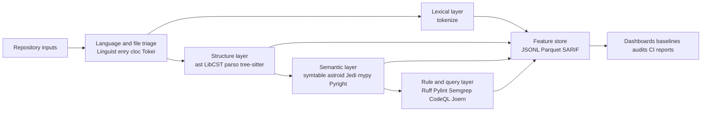
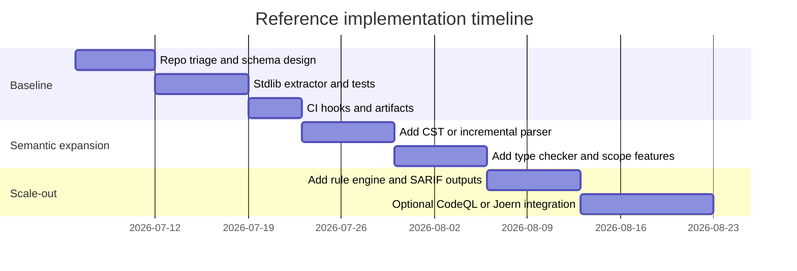

# Code feature extraction for Python source code

## Executive summary

The attached materials materially change the scope of the request. Although the prompt asks for a report on general “text features” including embeddings and multimodal methods, the authoritative specification document is explicitly about **code feature extraction from source code**, with Python as the primary qualification language, and the attached research guidelines exclude clone detection, decompilation, execution-based approaches, large generative models, and dense learned representations from the report’s core scope. They also ask for a landscape survey rather than rankings or prescriptive recommendations, and they forbid tables. This report therefore treats the target problem as **extracting explicit, analyzable features from Python source code** and addresses conflicting prompt items only where they can be reframed inside that scope. fileciteturn0file0 fileciteturn0file1 fileciteturn0file2

Within that scope, the most robust taxonomy is: **lexical features** from token streams and counts; **syntactic features** from AST or CST structure; **semantic features** from symbol tables, name binding, type information, control/data-flow, and inference; **contextual and project features** from cross-file references and repository structure; and **metadata/accounting features** such as language ID, line counts, complexity, maintainability, and dependency summaries. For Python specifically, the standard library already exposes a strong baseline stack through `tokenize`, `ast`, `symtable`, and `pyclbr`, while the broader ecosystem adds lossless concrete syntax trees, incremental parsers, inferred semantic graphs, lint/rule engines, and query systems such as LibCST, parso, tree-sitter, astroid, Ruff, Pylint, Semgrep, Pyright, mypy, CodeQL, Joern, Jedi, Universal Ctags, `cloc`, and Tokei. citeturn19view0turn19view1turn19view3turn19view4turn15view0turn14view1turn33view4turn32view2turn39view3turn26view0turn18view1turn39view0turn15view1turn15view2turn33view3turn30view1turn24view4turn39view4

The practical frontier for this scoped problem is **not** a single “best model.” Instead, it is a staged pipeline that starts with cheap lexical and structural extraction, then selectively adds semantic enrichment only when needed. Lossless or incremental parsers are preferable when whitespace, comments, exact spans, or editor responsiveness matter; inferred semantic representations are preferable when the target requires name resolution, types, or vulnerability-style queries; and lightweight accounting tools remain indispensable because they are cheap, reproducible, and easy to run continuously. Learned code representations remain adjacent rather than central here: they matter for type inference and repository-scale retrieval papers, but the attached brief excludes them from the main survey body. citeturn15view0turn14view1turn33view4turn32view2turn14view3turn15view2turn39view3turn24view4turn39view4turn42view0turn42view1 fileciteturn0file0

The highest-confidence implementation conclusion is that small and medium deployments can be built with **no model training at all**. A laptop-or-CI pipeline composed of stdlib parsing, Ruff, Radon, `cloc` or Tokei, and optionally mypy or Pyright already yields rich lexical, structural, type, and maintainability features. Repository-scale and security-heavy deployments add Semgrep, CodeQL, or Joern plus self-hosted runners or larger CI infrastructure. That means the dominant constraints are usually **parser fidelity, feature schema design, repository scale, and governance**, not GPU budget. citeturn19view7turn19view3turn39view3turn14view8turn24view4turn39view4turn39view0turn18view1turn26view1turn15view1turn15view2turn35view3

## Scope and conflict resolution

The governing documents set a clear priority order. The per-report brief defines the subject and required coverage; the text-and-code analysis guideline defines what qualifies as an entry and which adjacent areas must be excluded; and the general deep-research guideline controls the style and output discipline. Under that order, the report must be about **code feature extraction**, not generic NLP feature extraction, and it must avoid centering embeddings, multimodal models, or large code-generation systems. Where the prompt asks for comparative tables, explicit recommendations, or learned-representation analysis, I instead provide structured comparisons, reference pipeline profiles, and a short exclusion note because the attached materials override those parts of the prompt. fileciteturn0file0 fileciteturn0file1 fileciteturn0file2

Two practical consequences follow. First, the phrase “text features” is interpreted here as **features extracted from source text that is code**. Second, “embeddings,” “contrastive/self-supervised,” “multimodal,” and the PyTorch/TensorFlow/Hugging Face stack are treated as **adjacent background** rather than mainline coverage. They are relevant only when one intentionally expands the problem from explicit feature extraction into learned code representation learning. That expansion is documented as an open boundary, not as the report’s center of gravity. fileciteturn0file0 fileciteturn0file2 citeturn42view1turn42view3

One additional scoping detail from the attachments matters operationally: the report should focus on actual tools that a Python practitioner can use today. That favors entries that either process Python directly or expose Python-facing APIs. It also means some superficially relevant systems are out of scope for the core list. For example, `srcML` is a mature and actively released XML-based code representation system, but its current front page exposes C, C++, C#, and Java rather than Python, so it is relevant only as a contrasted exclusion, not as a core Python entry. fileciteturn0file2 citeturn15view3turn11view1

## Taxonomy of code features

A useful code-feature taxonomy starts with **lexical features**, the cheapest features to extract and often the most reproducible. For Python, the `tokenize` module yields a stable token stream, records source encoding, and exposes `exact_type` for operators, which is useful when one needs operator-level distributions rather than coarse token classes. On top of that stream, one can compute counts, n-grams, identifier-shape features, comment density, keyword rates, literal distributions, and whitespace or formatting markers. These are especially suitable for fast analytics, repository accounting, and fixed-schema classical models in scikit-learn. citeturn19view0turn19view1turn42view0

The next layer is **syntactic structure**. Python’s built-in `ast` creates abstract syntax trees directly from source, and nodes carry line and column offsets, which makes AST-derived span features feasible for function-, class-, block-, or statement-level extraction. AST is the right baseline when exact formatting fidelity is unnecessary and the goal is normalized structure: node histograms, subtree patterns, control-structure counts, import graphs, comprehension patterns, exception-handling shapes, and annotation density. citeturn19view7turn19view6

Where formatting, comments, or exact round-tripping matters, **concrete syntax features** become more appropriate than plain AST features. LibCST exposes parsing, metadata, scope analysis, and codemodding APIs; parso supports round-trip parsing, error recovery, and multiple Python versions; and tree-sitter is explicitly designed for incremental parsing, syntax-error robustness, and editor-speed updates. This family is better for exact-span feature extraction, code-review tooling, refactoring-sensitive extraction, and streaming or editor-side scenarios where reparsing the world on each keystroke is unacceptable. citeturn14view1turn31view0turn33view4turn15view0turn39view2

Above syntax sit **semantic features**, which are the most valuable and the most expensive. `symtable` exposes compiler-generated symbol-table information and scopes; `pyclbr` extracts classes and functions without importing untrusted code; astroid adds partial inference on top of ASTs and powers much of Pylint; Pyright and mypy provide static type-checking signals; Jedi adds reference, completion, and navigation facts useful for cross-file project features; and query systems such as CodeQL and Joern represent richer semantic relationships for variant analysis and vulnerability-style questions. Typical features here include scope depth, binding and shadowing structure, inferred value/type categories, call and reference relations, import reachability, data-flow links, and query-derived bug-pattern hits. citeturn19view3turn19view4turn32view2turn32view3turn18view1turn39view0turn33view3turn15view1turn15view2

Finally, there are **contextual and metadata features**. Language identification tools such as Linguist and enry infer file language and detection strategy; Universal Ctags emits symbol-oriented indices and has JSON/xref-style outputs plus Python parser documentation; `cloc` and Tokei supply line, comment, and file statistics at very low cost; and Radon computes cyclomatic complexity, Halstead metrics, raw metrics, and maintainability index. These are not “toy” features. In practice, they are often the most robust signals for dashboards, trend analyses, repository triage, and classical baselines. citeturn24view1turn24view3turn30view1turn15view4turn24view4turn39view4turn14view8turn14view9

## Methods and representative tool landscape

### Core parsing and structural extraction

The standard library is the lowest-friction baseline: `ast` for abstract structure, `tokenize` for lexical streams, `symtable` for compiler scopes, and `pyclbr` for safe module browsing from source rather than imports. This stack is version-aligned with CPython, requires no third-party runtime, and is simple to containerize. Its main limitation is that AST normalizes away formatting and comments, so it under-serves tasks that depend on exact surface syntax. citeturn19view7turn19view0turn19view3turn19view4

LibCST, parso, and tree-sitter occupy the next tier. LibCST is the cleanest option when one needs lossless Python syntax and metadata-aware transforms; parso is attractive when error recovery and multi-version parsing matter; tree-sitter dominates incremental and editor-centered use cases because it can update syntax trees efficiently as code changes and is intended to be fast enough for every keystroke. The trade-off is complexity: once you leave stdlib AST, you gain fidelity and resilience but also take on dependency and grammar-management overhead. citeturn14view1turn31view0turn33view4turn15view0turn39view2

### Semantic enrichment and static analysis

Astroid and Pylint represent a long-standing Python tradition of inference-oriented static analysis. Astroid is explicitly an AST parsing, static analysis, and inference library; Pylint’s own package page explains that it relies on astroid inference, which helps it catch issues that simpler, purely syntactic linters miss, though at a runtime cost. This is a useful dividing line in feature extraction: if the application needs value- or alias-aware facts, the faster lexical-only path stops being enough. citeturn32view2turn32view3

Ruff, Pyright, and mypy show three different semantics/throughput trade-offs. Ruff is intentionally optimized for speed, ships over 900 built-in lint rules, includes caching and autofix, and aims for parity with several widely used Python linters and formatters. Pyright is a high-performance, standards-based static type checker designed to scale to large Python codebases. Mypy provides static type checking, incremental mode, parallel configuration, plugins, stub generation, and a daemon mode. Together, they form a practical gradient from very-fast syntactic and rule-based extraction toward richer type- and annotation-based semantic features. citeturn39view3turn25view0turn18view1turn39view0

Jedi belongs in this landscape because modern code-feature extraction often needs project-context signals rather than just per-file syntax. Jedi is a static analysis library focused on autocompletion, goto, refactoring, code search, and finding references. In feature-extraction terms, it is useful for symbol-level context features, especially in editor or language-server adjacent workflows. citeturn33view3turn33view2

### Query engines, security-oriented extractors, and repository-scale systems

Semgrep, CodeQL, and Joern all move beyond “feature extraction” in a narrow sense, but they are central because they operationalize higher-order features as queryable facts. Semgrep states that its rules combine pattern matching logic and data-flow analysis, and its supported-languages documentation shows broad language coverage with increasingly advanced cross-file and framework-specific analyses, including Python. CodeQL describes code as queryable data and supports custom queries over generated databases. Joern builds code property graphs and lets users mine them through a Scala-based query language for cross-language code analysis. citeturn26view0turn26view1turn15view1turn14view3turn15view2

For Python-heavy environments, the main distinction is setup cost versus semantic power. Semgrep is comparatively easy to operationalize for rule-centric scanning and custom pattern extraction. CodeQL has higher setup and database-generation overhead but stronger variant-analysis ergonomics and deep GitHub integration. Joern is especially strong when graph-based security analysis and multi-language semantic traversals matter. These are usually **server-side or batch** tools rather than on-device defaults. citeturn26view0turn15view1turn38view1turn15view2turn35view3

### Accounting, indexing, and language identification

Cheap metadata systems should not be underestimated. `cloc` counts blank, comment, and code lines and can diff codebases; Tokei emphasizes speed, language breadth, structured output, and the ability to count millions of lines in seconds; Linguist exposes and explains language-detection strategies; enry provides a faster compatible detector and documents several text-based detection strategies, including shebang, modeline, and Bayesian classification; Universal Ctags supports Python and exposes JSON and xref-oriented workflows. These tools are ideal for early-stage data profiling, repository filtering, and building compact, audit-friendly feature stores. citeturn24view4turn39view4turn24view1turn24view3turn30view1turn11view2

## Evaluation, datasets, and reproducible study design

For the attached scope, the most informative **intrinsic** metrics are not embedding reconstruction scores. They are parser and extractor quality metrics: parse success on clean files, degradation on syntactically broken files, span fidelity, feature stability under formatting-only diffs, throughput, memory footprint, and schema completeness. Tree-sitter and parso explicitly foreground error tolerance and incremental or round-trip behavior, which is why they are strong intrinsic baselines. For metadata layers, Tokei and `cloc` are useful because they expose performance-oriented and auditable statistics cheaply. citeturn15view0turn39view2turn33view4turn24view4turn39view4

The most useful **extrinsic** metrics depend on the target task. For type-related extraction, Type4Py reports mean reciprocal rank on a type-checked dataset, while newer work such as Typify evaluates variable, argument, and return-type prediction against ManyTypes4Py and Typilus-family datasets. For static type error remediation, PyTy evaluates on real-world type faults and reports successful fixes on a large share of observed errors. For maintainability-oriented feature stacks, CodeScene argues that its aggregated Code Health factors correlate with maintenance costs and defect risk. These examples all support the same conclusion: code-feature extraction is best evaluated by the performance of the downstream analytic job it enables, not only by internal consistency. citeturn22academia2turn22academia0turn20academia1turn40academia2turn40academia0turn23view1

The best-aligned public datasets for Python semantic features are **ManyTypes4Py**, **CrossDomainTypes4Py**, and **PyTyDefects**. ManyTypes4Py contains 5,382 Python projects and more than 869,000 type annotations, with duplicate code removed and a lightweight AST-analysis pipeline stored as JSON. CrossDomainTypes4Py extends evaluation across domains and reports more than one million type annotations spanning web development and scientific calculation. PyTyDefects contributes 2,766 type-error/fix pairs from 176 GitHub repositories. For larger-scale corpus stress tests and legal/governance analysis, The Stack provides a permissively licensed 3.1 TB multi-language corpus with documented removal/governance mechanisms, while The Heap provides a contamination-conscious multilingual evaluation corpus. citeturn20academia1turn40academia1turn40academia0turn41academia3turn41academia1

A reproducible reference study for this scoped problem can be built in three tiers. A **lexical baseline** should use `tokenize` plus metadata counters and train only classical models over explicit features. A **structural baseline** should add AST or CST node histograms, depth statistics, import patterns, and scope features from `symtable`. A **semantic baseline** should add one type checker and one query engine, such as Pyright or mypy plus Semgrep or CodeQL, then compare the incremental gain in downstream performance and runtime. Project-level rather than file-level splits should be used to avoid leakage; all extractor versions should be pinned; and outputs should be serialized as JSONL or Parquet with a feature-schema revision string. This is the right place for scikit-learn: it natively supports preprocessing, classification, clustering, dimensionality reduction, cross-validation, and model selection over explicit feature vectors. citeturn19view0turn19view3turn14view1turn39view0turn18view1turn26view0turn15view1turn42view0

The requested “embedding/clustering/similarity” dimension should therefore be interpreted narrowly. Clustering and dimensionality reduction are sensible **secondary analyses over explicit features** using scikit-learn. Dense representation learning in PyTorch, TensorFlow, or Hugging Face is methodologically adjacent but excluded from the report’s mainline by the attached brief. If a future study broadens the scope, those frameworks become central; in the present scope, they are controls or expansion paths rather than primary methods. fileciteturn0file0 citeturn42view0turn42view1turn42view3

### Reference extractor recipe

The following snippet shows a small, explicit, no-training extractor built only on the Python standard library. It is appropriate for lexical, structural, and scope features, and it keeps the feature schema transparent. The APIs used below are documented in the CPython standard library. citeturn19view0turn19view3turn19view7

```python
from __future__ import annotations

import ast
import io
import json
import tokenize
import symtable
from collections import Counter
from pathlib import Path
from typing import Any

def extract_python_features(path: str | Path) -> dict[str, Any]:
    path = Path(path)
    source = path.read_text(encoding="utf-8")

    # Lexical features
    tok_counter: Counter[str] = Counter()
    op_counter: Counter[str] = Counter()
    for tok in tokenize.generate_tokens(io.StringIO(source).readline):
        tok_counter[tokenize.tok_name[tok.type]] += 1
        if tokenize.tok_name[tok.type] == "OP":
            op_counter[str(tok.exact_type)] += 1

    # Structural features
    tree = ast.parse(source, filename=str(path))
    node_counter = Counter(type(node).__name__ for node in ast.walk(tree))
    functions = sum(isinstance(n, (ast.FunctionDef, ast.AsyncFunctionDef)) for n in ast.walk(tree))
    classes = sum(isinstance(n, ast.ClassDef) for n in ast.walk(tree))
    imports = sum(isinstance(n, (ast.Import, ast.ImportFrom)) for n in ast.walk(tree))

    # Scope features
    st = symtable.symtable(source, str(path), "exec")
    children = st.get_children()

    return {
        "file": str(path),
        "n_functions": functions,
        "n_classes": classes,
        "n_imports": imports,
        "token_counts": dict(tok_counter),
        "operator_counts": dict(op_counter),
        "ast_node_counts": dict(node_counter),
        "top_level_child_scopes": [c.get_name() for c in children],
        "python_lines": len(source.splitlines()),
        "schema_version": "v1",
    }

if __name__ == "__main__":
    out = extract_python_features("example.py")
    print(json.dumps(out, indent=2, sort_keys=True))
```

### Reference CI and governance recipe

Reproducibility for explicit feature extraction is mainly a **software-governance** problem, not a GPU problem. `pre-commit` is designed to manage multi-language hooks, GitHub Actions automates repository workflows and supports artifacts, caching, concurrency controls, and self-hosted runners, DVC focuses on versioning data/models/experiments and defines pipeline/metrics/params primitives, and MLflow provides experiment tracking and model-lifecycle functionality. In a strict feature-extraction program, the minimum viable governance set is: pinned extractor versions, pre-commit hook enforcement, CI matrix tests across Python versions, immutable output artifacts, and data-versioned benchmark inputs. citeturn34view0turn35view3turn37view1turn35view5

```yaml
# .pre-commit-config.yaml
repos:
  - repo: https://github.com/astral-sh/ruff-pre-commit
    rev: v0.15.0
    hooks:
      - id: ruff
      - id: ruff-format
  - repo: local
    hooks:
      - id: feature-smoke-test
        name: feature-smoke-test
        entry: python -m pytest tests/test_extractors.py -q
        language: system
        pass_filenames: false
```

```yaml
# .github/workflows/features.yml
name: feature-extraction-ci
on: [push, pull_request]

jobs:
  test:
    runs-on: ubuntu-latest
    strategy:
      matrix:
        python-version: ["3.12", "3.13", "3.14"]
    steps:
      - uses: actions/checkout@v4
      - uses: actions/setup-python@v5
        with:
          python-version: ${{ matrix.python-version }}
      - run: pip install -r requirements-dev.txt
      - run: pre-commit run --all-files
      - run: pytest -q
      - run: python scripts/extract_benchmark.py --out artifacts/features.jsonl
      - uses: actions/upload-artifact@v4
        with:
          name: features-${{ matrix.python-version }}
          path: artifacts/features.jsonl
```

## Operational patterns, budget profiles, and timelines

### System architecture

The most stable architecture for this problem is a layered extractor that separates cheap universal passes from expensive semantic passes. That separation improves reproducibility and lets teams compute only the features they actually need. The component families shown below are all backed by current official documentation. citeturn24view1turn24view4turn39view4turn19view0turn19view7turn14view1turn15view0turn19view3turn32view2turn39view0turn18view1turn26view0turn15view1turn15view2



### Reference pipeline profiles

A **small-budget profile** is laptop-friendly and CI-friendly. It uses stdlib extraction, Ruff, Radon, and `cloc` or Tokei. This profile is strongest when the goal is repository accounting, maintainability dashboards, light classification, or robust baseline features. It has very low setup overhead because the parsers are either part of CPython or packaged as straightforward CLI tools, and no model training is required. citeturn19view0turn19view7turn14view8turn24view4turn39view4turn39view3

A **medium-budget profile** adds one high-fidelity parser and one semantic checker. In practice that means LibCST or tree-sitter plus Pyright or mypy, with Semgrep for custom rule extraction. This profile is appropriate when exact source spans, comments, framework-aware rules, or project-context features matter. The cost increase comes mostly from dependency management, cache design, and CI runtime, not from specialized hardware. citeturn14view1turn15view0turn39view2turn18view1turn39view0turn26view0turn26view1

A **large-budget profile** adds queryable semantic databases and repository-scale orchestration: CodeQL or Joern, self-hosted or larger runners, artifact retention, and optional commercial overlays such as SciTools Understand or CodeScene when the goal expands from extraction into organizational governance and historical risk analytics. This profile is justified when cross-repository variant analysis, rich security queries, or enterprise portfolio visibility matter. citeturn15view1turn38view1turn15view2turn35view3turn23view0turn23view1

### Reference resource estimates

Because the scoped methods are explicit extractors rather than learned representation systems, compute cost is usually modest. A small-budget profile normally needs only standard CI runners or developer laptops. Medium-budget profiles benefit from persistent caches and somewhat longer CI windows because type checking and CST parsing can dominate runtime. Large-budget query systems benefit from server-side orchestration, especially when databases or graph stores are materialized across many repositories. This estimate is an inference from current tool architecture and deployment guidance rather than a vendor benchmark. citeturn39view3turn39view4turn18view1turn39view0turn35view3turn38view1turn15view2

### Reference implementation timeline

The following schedule is a reasonable implementation envelope **if starting from existing tools rather than training models**. The durations are analytic estimates derived from the maturity and packaging of the cited tools.



In practice, a small profile is often a **one- to two-week** effort for one engineer, a medium profile a **three- to five-week** effort, and a large profile a **six- to eight-week** effort once cross-repository orchestration and governance are included. Those ranges assume benchmark data already exists and the organization is not simultaneously building a custom labeled dataset. citeturn34view0turn35view3turn37view1turn18view1turn39view0turn15view1turn15view2

## Open questions and limitations

The main limitation is deliberate: this report follows the attached brief rather than the broader wording of the prompt. As a result, it does **not** provide a full survey of transformer embeddings, contrastive objectives, multimodal code-text pipelines, or LLM-based code feature learning. Those topics are important in the broader literature, and recent datasets and framework docs were noted during research, but they fall outside the authoritative scope here. fileciteturn0file0 citeturn42view1turn42view3

A second limitation is that some industrial tools were easy to verify at the documentation level but harder to benchmark uniformly from public official sources alone. The highest-confidence comparisons in this report therefore focus on documented capabilities, maintenance signals, and representative deployment fit, rather than on claiming a universal performance ranking. That restraint is consistent with the attached guidelines and better aligned with the current evidence base. fileciteturn0file1 fileciteturn0file2

A final boundary condition is that not every adjacent code-analysis system qualifies as a core Python code-feature extractor. `srcML` is the clearest example: it is active and useful, but its current official language list does not foreground Python, so it belongs in a contrasted exclusion bucket for this report. Similar exclusions apply to clone-detection systems, execution/profiling frameworks, decompilers, and large code-generation models. citeturn15view3turn11view1 fileciteturn0file0