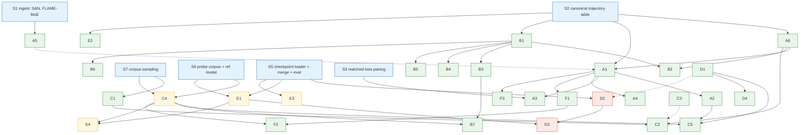

Structured extraction of every analysis idea in
[research-trajectory-published-data-analyses.md](research-trajectory-published-data-analyses.md),
organized so we can decide what to do first and what infrastructure serves
multiple paths. Each idea gets an ID (`A1`, `B3`, …) used throughout for
dependencies.

Compute tiers used below:

| Tier | Meaning |
|------|---------|
| **T0** | Pure analysis of published tables. No model forward passes. |
| **T1** | Light inference: forward passes over a fixed probe corpus or eval set with existing checkpoints (no training). |
| **T1+** | Eval-only but broader: checkpoint merging + re-running evals on merged models. |

Everything here is T0–T1+. Nothing requires training.

---

## 1. Data inventory

What each idea consumes, and what this repository already materializes
(see `README.md`; processed tables under `data/processed/`).

| Artifact | Status in repo | Consumed by |
|----------|----------------|-------------|
| Aggregate OLMES per task × checkpoint (`processed/olmes.parquet`), with `lr_at_step`, `cumulative_lr`, tokens, FLOPs | Available | A, B (aggregate), C2, D1, D4 |
| OLMES per-instance + per-choice details (`processed/olmes-details/{recipe}/instances.parquet`, `choices.parquet`) | Available per recipe | B (item matrix), E2, A6 (item bootstrap) |
| Perplexity evals over a range of held-out corpora (`processed/ppl.parquet`) | Available | A (continuous-metric trajectories), C3 |
| Scaling-law checkpoint losses + throughput (`processed/scaling-law/checkpoint-losses.parquet`) | Available | D1 |
| Published-results CSV/JSON units (pairwise decisions, per-task breakdowns, figures) | Available | C2 targets, cross-checks |
| Signal-and-Noise release (900K results, 465 models, incl. OLMo + DataDecide + ladder intermediate checkpoints) | **Not ingested** — verify overlap with OLMES tables; OLMo dense trajectories are the unique value | A1, A5 |
| DataDecide checkpoints (HF weights) | Not ingested | D2, D3, E1, E3, C4 (as reference model, optional) |
| DataDecide pretraining corpora (25 recipes) | Not ingested; sampling tooling needed | C1, C4 |
| FLAME-MoE checkpoints, routing logs, eval results | Not ingested | F |
| A reference model for token entropy (larger open model or ensemble) | Not ingested | C4 |

Key observation: because per-instance OLMES details are already parsed, the
IRT response matrix (**B**) and item-level churn (**E2**) are T0 here, not T1.

---

## 2. Idea catalog

### Track A — Eval-trajectory movement analysis (Signal-and-Noise dual)

Treat checkpoint-to-checkpoint change as the object rather than the nuisance
term. All T0.

| ID | Idea | Inputs | Depends on | Relation to others |
|----|------|--------|------------|--------------------|
| **A6** | **Noise-floor estimation.** (a) Pooled seed variance across 25 recipes × 3 seeds at fixed scale, with a heteroscedasticity test across recipes (a recipe whose seeds diverge more is itself a finding). (b) Trajectory-as-replicate: late-checkpoint window variance as a proxy for run-to-run noise, corrected for within-window drift using A1. (c) Bootstrap over items for benchmark-composition uncertainty. | OLMES aggregate + instances | — | **Foundation for every significance claim in A–F.** B2 is an alternative route to lower noise. |
| **A1** | **Drift/diffusion decomposition** of each eval trajectory: autocorrelation of increments, sign-consistency, variance-vs-lag (diffusion ∝ lag, drift ∝ lag²). Run per benchmark × recipe × scale × seed. Output: a "movement SNR table" — which evals detect learning between adjacent checkpoints vs. only wiggle. | OLMES aggregate, PPL | A5 (resolution) | Core instrument; A2–A4, D3, F1 build on it. |
| **A2** | **River-valley test within a trajectory:** diffusion magnitude should scale with current LR (walls), drift should not (river). The cosine schedule is a natural within-run LR sweep. | A1 output + `lr_at_step` | A1 | Cheapest test of the river-valley mechanism available without training. Feeds C5. |
| **A3** | **Recipe-dependent drift/diffusion signatures at matched loss.** Any benchmark where recipes differ in signature at the same loss is "pretraining shapes models beyond final performance" appearing in public data. | A1 output + loss | A1, S3 (matched-loss pairing) | **Alternative formalization to B3 (recipe-DIF).** Same question, statistical vs. psychometric instrument. |
| **A4** | **Re-derive Signal-and-Noise findings** in the new frame: predict continuous metrics (PPL, likelihood margins) have high drift-to-diffusion ratio, accuracy low; recover "filter noisy subtasks" as a consequence. | A1 output | A1 | Validation/sanity check for A1; overlaps B5. |
| **A5** | **Temporal-resolution handling.** DataDecide checkpoint spacing is sparse, so small-lag statistics may be drift-dominated. Fit the diffusion model on dense OLMo trajectories (Signal-and-Noise release), transfer to DataDecide's grid. | Signal-and-Noise release | S1 (ingest) | Supports A1; optional if DataDecide spacing proves adequate. |

### Track B — Psychometric reanalysis (IRT on the DataDecide matrix)

Rows = model × checkpoint (organized as recipe × scale × seed × step), columns
= items. All T0 given `instances.parquet`.

| ID | Idea | Inputs | Depends on | Relation to others |
|----|------|--------|------------|--------------------|
| **B1** | **Dimensionality check.** Does one latent θ fit the matrix? If yes → recipes at these scales differ mostly along one axis (matched-loss ≈ matched-everything, deflating part of the hypothesis). If no → the factor structure *is* the answer to "what do recipes change besides final performance." | Item matrix | S2 | **First step of Track B; either outcome is a result.** Gates B2–B5. |
| **B2** | **θ(t) as movement metric.** Is SNR(θ trajectories) > SNR(accuracy trajectories)? IRT estimates the item weights that Signal-and-Noise's subtask filtering sets to 0/1. | B1 fit | B1, A6 | **Alternative to A4/raw accuracy as the base metric.** Feed θ(t) back into A1 as another trajectory type. |
| **B3** | **Recipe-DIF** (differential item functioning): items that behave differently across recipes at the same ability. The psychometric matched-loss comparison. | B1 fit | B1 | **Alternative to A3.** Produces the item set for B7. |
| **B4** | **Item characteristic curves vs. compute → per-item emergence points.** Turns "emergence" into a distribution over items; a per-item loss-to-accuracy mapping for the proxy-metric thread. | B1 fit + FLOPs | B1 | Independent of B2/B3; connects to D1 (schedule-corrected loss as the x-axis). |
| **B5** | **Binary vs. continuous-response IRT** (on likelihood margins from `choices.parquet`). Binary discards the margin information that carries small-scale signal; the comparison replicates the metric-choice finding inside one framework. | Item matrix + choices | B1 | Overlaps A4; decides which response model B2–B4 should use. |
| **B6** | **Local-independence diagnostics** as a byproduct: shared-passage items and contamination show up as misfit. | B1 fit | B1 | Cheap; informs item filtering for everything else. |
| **B7** | **Cluster DIF items** by domain and by token-determinism bucket. Connects the eval layer to the data-featurization layer. | B3 + C4 | B3, C4 | Cross-track; first place T1 inference becomes necessary in Track B. |

### Track C — Dataset featurization (the 25 corpora as a supervised problem)

| ID | Idea | Tier | Inputs | Depends on | Relation to others |
|----|------|------|--------|------------|--------------------|
| **C1** | **Intrinsic corpus statistics** for each recipe: WIMBD-style duplication, length distributions, domain composition; compression ratio (gzip/entropy-law); Zipf / burstiness / type-token statistics; diversity coefficient (Task2Vec — needs a probe model, so T1 for that one feature). | T0 (T1 for diversity coeff.) | Corpus samples (S7) | S7 | Feature table consumed by C2, C5. |
| **C2** | **Features → outcomes regression.** Predict the published outcome table (25 corpora, ~300 pairwise decisions, per-task breakdowns) from C1 features; ask which features carry signal and whether intrinsic features match model-mediated ones. | T0 | C1 + OLMES/published results | C1, A6 (significance), optionally B2 (θ as a cleaner target) | Could use θ(t) or drift rate (A1) as targets instead of final accuracy — three alternative targets for the same regression. |
| **C3** | **Model-mediated features as the comparison baseline.** Perplexity-correlation-style profiles. DataDecide's own cross-corpus PPL table gives a zero-cost version: each recipe's perplexity profile over held-out corpora. | T0 (T1 if extended) | `ppl.parquet` | — | Baseline C2 must beat or match to claim intrinsic features are informative. |
| **C4** | **Determinism profile:** score corpus samples with a reference model's conditional entropy (or an ensemble to separate aleatoric floor); characterize each corpus by its per-token entropy distribution; "% deterministic tokens" as a threshold statistic. | T1 | Corpus samples + reference model (S6) | S7, S6 | **Shared input for B7, E4, F2, C5.** The single T1 investment with the most downstream consumers. |
| **C5** | **Determinism profile → landscape geometry.** Does C4 predict annealing behavior (D1/D2 correction size) and/or the LR-sensitivity of diffusion (A2) per recipe? | T0 given inputs | C4 + A2/D1 | C4, A2 or D1 | Ties the featurization and schedule-confound tracks together. |

### Track D — Schedule-confound correction (annealing without annealing)

DataDecide checkpoints sit mid-cosine with high residual LR; evals measure
"position along the river + distance up the wall."

| ID | Idea | Tier | Inputs | Depends on | Relation to others |
|----|------|------|--------|------------|--------------------|
| **D1** | **Multi-power-law correction.** Fit the MPL to each run's loss curve + LR schedule, predict the loss drop a hypothetical decay would produce at each checkpoint, and report how much of each recipe's apparent ranking/level is schedule artifact. | T0 | `checkpoint-losses.parquet`, `lr_at_step`, `cumulative_lr` | — | Loss-only; gives no downstream metrics. **Alternative to D2** for levels; complementary for validation. |
| **D2** | **Checkpoint merging as annealing proxy on cosine checkpoints.** WSM-style merging with emulated-decay weights, on mid-run checkpoints where LR varies within the merge window. Open question whether it works outside stable-phase. Validate against D1's predicted drop and against the run's own final (fully decayed) checkpoint. | T1+ | HF checkpoints + eval harness (S5) | S5 | **Alternative to D1** that does yield downstream metrics; if it works, retrofits "annealed" evals onto all of DataDecide for eval cost. |
| **D3** | **Durable-movement operator:** movement that survives the schedule-neutralizing transform. Compare merged(t) vs. merged(t+k); also KL(t, t+k) vs. k (transient cancels, durable accumulates). Decomposes Signal-and-Noise "noise" into measurement noise + wall oscillation + unresolved drift. | T1+ | D2 + E1 | D2, E1 | Causal counterpart to A1's statistical decomposition. |
| **D4** | **When does the confound cancel?** DataDecide found intermediate-checkpoint *decisions* match compute-equivalent final checkpoints, so the confound may cancel for rankings while distorting levels. Quantify where it cancels vs. not, using D1 (and D2 if available). | T0 | D1 output | D1 | Directly informs how much to trust every ranking-based claim in A–C. |

### Track E — Token- and item-level movement between checkpoints

| ID | Idea | Tier | Inputs | Depends on | Relation to others |
|----|------|------|--------|------------|--------------------|
| **E2** | **Prediction-flip rates on benchmark items** between adjacent checkpoints (churn): how much of a flat accuracy curve hides large item-level exchange. | **T0** (per-instance details exist) | `instances.parquet` | S2 | Cheapest item-level movement metric; natural companion to A1 and B2. |
| **E1** | **Per-token KL(checkpoint_t ‖ checkpoint_t+1)** on a fixed probe corpus. | T1 | HF checkpoints + probe corpus (S5, S6) | S5, S6 | Finer than E2; input to D3, E4. |
| **E3** | **Layerwise representation drift** (CKA / linear-map residual per layer) between checkpoints. | T1 | HF checkpoints | S5 | Independent channel; "where" movement lives. |
| **E4** | **Slice E1 by C4 entropy buckets.** Hypothesis: adjacent-checkpoint movement concentrates on high-entropy (hillside) tokens mid-schedule; low-entropy tokens carry the drift. If so, it yields a principled low-noise eval construction (weight items by token determinism) replacing empirical subtask filtering. | T1 | E1 + C4 | E1, C4 | The "one figure" connecting Signal-and-Noise to the landscape mechanism. |

### Track F — MoE extension (FLAME-MoE released artifacts)

Included for the published routing logs; a categorical, high-sensitivity
movement channel. All T0 once ingested.

| ID | Idea | Inputs | Depends on | Relation to others |
|----|------|--------|------------|--------------------|
| **F1** | **Routing-flip drift/diffusion and saturation curves** from released routing logs: flips that revert = wall oscillation, flips that persist = river movement; saturation curves = cumulative commitment plots, per layer. | FLAME-MoE routing logs (S1) | A1 machinery | A1 applied to a categorical channel. |
| **F2** | **Slice routing flips by token-entropy bucket:** do hillside tokens keep flipping experts after river tokens' routes freeze? | F1 + C4 | F1, C4 | MoE analogue of E4. |
| **F3** | **Dense control ladder:** DataDecide small dense models at matched active params, so every MoE finding has an "is this MoE or just small models" comparison. | OLMES aggregate | A1 | Free given Track A. |

---

## 3. Dependency structure

Dotted edges are optional/strengthening inputs. Green = T0, yellow = T1,
red = T1+, blue = shared infrastructure.

### Alternatives (pick one, or run both as a comparison)

| Question | Option 1 | Option 2 | Note |
|----------|----------|----------|------|
| Base metric for "movement" | Raw accuracy / PPL trajectories (A1) | IRT ability θ(t) (B2) | B2 is itself a test; A1 machinery is metric-agnostic, so run A1 on both. |
| Matched-performance recipe comparison | Matched-loss drift/diffusion signatures (A3) | Recipe-DIF (B3) | Different instruments for the same claim; agreement would be strong evidence. |
| Schedule-confound correction | Analytic MPL on loss (D1) | Checkpoint merging + re-eval (D2) | D1 is T0 but loss-only; D2 gives downstream metrics but costs evals and is unvalidated on cosine. D1 validates D2. |
| Regression target for dataset features (C2) | Final accuracy / pairwise decisions | θ (B2) or drift rate (A1) | Cleaner targets may reveal features that accuracy noise hides. |
| Dataset features | Intrinsic statistics (C1) | Model-mediated PPL profiles (C3) | Not exclusive: C3 is the baseline C1 must match. |

### Builds-on chains (longest value paths)

- **A6 → A1 → A2 → C5**: noise floor → movement decomposition → river-valley LR test → does data determinism predict it. Entirely T0 except C4 input to C5.
- **B1 → B3 → B7 (+C4)**: dimensionality → recipe-DIF → DIF items explained by token determinism.
- **S5 → D2 → D3 (+E1)**: merging proxy → durable-movement operator. The only chain requiring T1+.
- **C4 → {B7, E4, F2, C5}**: one T1 artifact unlocks four cross-track analyses.

---

## 4. Shared infrastructure

What to build once so multiple tracks can proceed.

| ID | Component | Serves | Notes |
|----|-----------|--------|-------|
| **S2** | **Canonical long trajectory table**: one row per (recipe, scale, seed, step, task, item-or-aggregate, metric, value) with the checkpoint derivations already on the OLMES tables. Plus a "trajectory" accessor that returns ordered series per (recipe, scale, seed, task, metric). | A, B, E2, F3 | Mostly a thin view over existing processed tables. Highest leverage, lowest cost. |
| **S4** | **Noise-floor / significance module** implementing A6 (pooled variance, windowed replicate, item bootstrap) as reusable functions. | All tracks | A6 is both an analysis and a library. |
| **S3** | **Matched-loss / matched-ability pairing** utility: given a target loss (or θ), find the checkpoint per recipe × seed closest to it, with interpolation and tolerance reporting. | A3, B3, C2 (matched targets) | Small; needed before any "beyond final performance" claim. |
| **S1** | **Ingest for external releases**: Signal-and-Noise eval release; FLAME-MoE routing logs/evals. Follow the repo's existing download → preprocess → typed parquet pattern. | A5, F | Check overlap between S&N's DataDecide rows and the OLMES tables before ingesting; OLMo dense trajectories and routing logs are the unique parts. |
| **S7** | **Corpus sampling**: reproducible stratified samples from each of the 25 recipe corpora, with sample manifests. | C1, C4 | Needed before any Track C work. Size by what C1 statistics require; C4 can use a subsample. |
| **S6** | **Probe corpus + reference-model scoring**: fixed probe set; per-token entropy from a reference model (and optionally an ensemble for aleatoric estimation); cached per-token scores. | C4, E1, E4, F2 | First T1 investment. Cache aggressively; everything downstream is T0 over the cache. |
| **S5** | **Checkpoint loader + merge + eval harness**: load DataDecide HF checkpoints, sliding-window weighted merge, run OLMES-equivalent evals and per-token KL/CKA. | D2, D3, E1, E3 | Largest build. Defer until T0 tracks have shown where T1+ is worth it. |

---

## 5. Sequencing proposal

Ordered by value-per-cost and dependency, not by track.

**Wave 0 — T0 only, existing tables (S2, S4, S3):**
1. A6 noise floor (also produces S4).
2. A1 drift/diffusion on accuracy, PPL, and likelihood-margin trajectories; A4 sanity check.
3. E2 item flip rates (cheap, same tables).
4. B1 dimensionality, then B5 (binary vs. margin) to fix the response model, then B2 (θ(t) SNR vs. A1's).
5. D1 multi-power-law correction and D4 ranking-vs-level cancellation.

Decision point after Wave 0: which base metric (accuracy / margin / θ) carries
the most drift-to-diffusion signal, and how large the schedule artifact is.
These two answers reshape everything downstream.

**Wave 1 — T0 plus corpus sampling (S7, S3):**
6. A2 river-valley LR test; A3 and B3 matched-performance comparisons (run both; compare).
7. B4 per-item emergence; B6 diagnostics.
8. C1 intrinsic features, C3 PPL-profile baseline, C2 regression against the chosen targets.
9. F1/F3 if FLAME-MoE ingest (S1) is cheap — otherwise defer the whole track.

**Wave 2 — first T1 investment (S6):**
10. C4 determinism profiles → B7, C5, (F2).
11. E1 per-token KL, E4 entropy-bucket slice. E3 if S5's loader exists.

**Wave 3 — T1+ (S5):**
12. D2 merging proxy, validated against D1 and final checkpoints; D3 durable-movement operator.

Only build S5 if Wave 0–2 results make the annealing question load-bearing
(e.g., D4 shows the confound does *not* cancel for the comparisons we care
about).

---

## 6. Open questions to resolve before committing

- How much of the Signal-and-Noise release duplicates the OLMES tables already
  parsed here, and are the OLMo dense trajectories needed (A5) given
  DataDecide's actual checkpoint spacing?
- Is per-instance detail available for every recipe × scale × seed, or only a
  subset? This bounds the IRT matrix and E2.
- Does DataDecide publish the loss curves at sufficient resolution for D1, or
  only the scaling-law subset?
- Which reference model for C4: a single larger open model, an ensemble of
  DataDecide final checkpoints (aleatoric estimate for free), or both?
